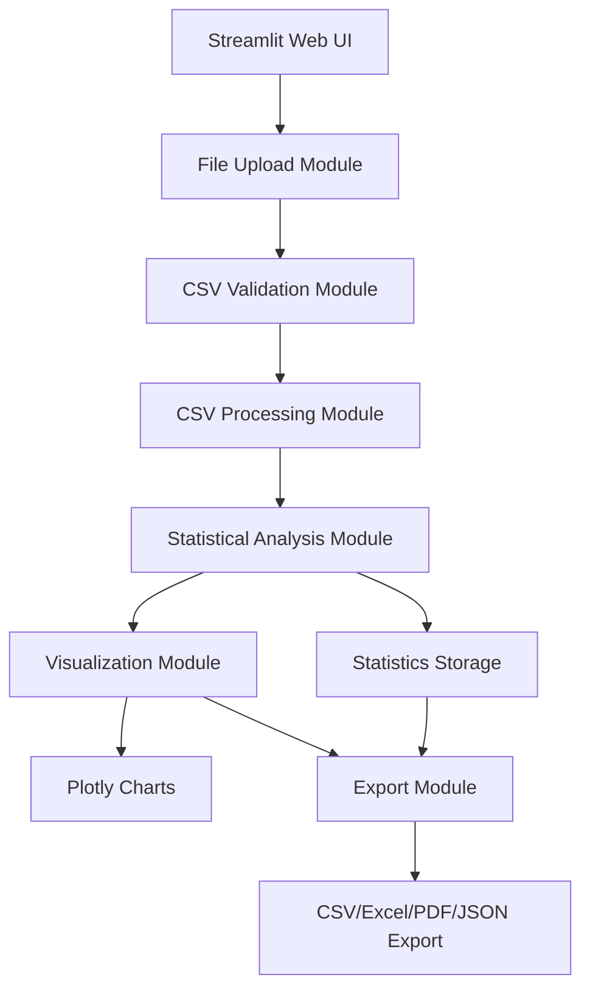

# CSV Statistics Dashboard - CLI to Web Application Converter - Product Requirements Document

## Executive Summary

### Problem Statement

CSV files are ubiquitous in data analysis workflows, but understanding data characteristics requires command-line tools like csvkit's `csvstat`. Non-technical users struggle with CLI interfaces, and even technical users benefit from visual representations of data statistics. Current solutions require command-line expertise and don't provide interactive visualization of statistical insights.

### Proposed Solution

Convert csvkit's `csvstat` command-line tool into an interactive web application that allows users to upload CSV files, automatically analyze column statistics (data types, counts, unique values, missing values, etc.), and visualize these insights through interactive charts and tables. The solution will preserve all statistical analysis capabilities while providing an intuitive web interface accessible to both technical and non-technical users.

### Expected Impact

- **User Benefits**: No command-line knowledge required, instant visual insights into data characteristics, interactive exploration of statistics, and easy sharing of analysis results
- **Business Value**: Democratizes data analysis, reduces learning curve for data exploration, enables faster data quality assessment, and improves collaboration through web-based interface
- **Technical Value**: Demonstrates CLI-to-Web conversion capabilities, reusable pattern for converting other csvkit utilities, and showcases data visualization best practices

### Success Metrics

- CSV file upload and processing time &lt; 3 seconds for files up to 10MB
- Statistical analysis completes within 2 seconds for files with up to 100 columns
- Chart rendering time &lt; 1 second
- Support for CSV files with up to 100,000 rows without performance degradation
- User satisfaction score &gt; 4.0/5.0
- Conversion accuracy: 100% statistical match with original csvstat output

## Requirements & Scope

### Functional Requirements

**REQ-1: CSV File Upload and Validation**The system must support uploading CSV files through a web interface, validate file format, detect encoding (UTF-8, Latin-1, etc.), handle various CSV delimiters (comma, semicolon, tab), and provide clear error messages for invalid files.

**REQ-2: Data Preview**The system must display a preview of uploaded CSV data showing the first 10-20 rows, column names, total row and column counts, and basic file metadata (file size, encoding detected).

**REQ-3: Automatic Statistical Analysis**The system must automatically analyze each column in the CSV file and compute statistics including:

- Data type detection (text, integer, float, date, boolean)
- Total count of non-null values
- Count of null/missing values
- Count of unique values
- Most frequent values (top 5)
- For numeric columns: min, max, mean, median, standard deviation
- For text columns: min/max length, average length
- For date columns: earliest date, latest date, date range

**REQ-4: Statistical Results Display**The system must display statistical results in a structured table format with one row per column, showing all computed statistics in an organized, sortable table with clear column headers.

**REQ-5: Interactive Data Visualization**The system must provide interactive visualizations for statistical data including:

- Bar charts for unique value counts per column
- Pie charts for data type distribution
- Histograms for numeric column distributions
- Missing value heatmap showing null patterns across columns
- Correlation heatmap for numeric columns (optional)
- Column statistics summary cards (KPI cards)

**REQ-6: Chart Interactivity**Charts must support zoom, pan, hover tooltips with detailed information, click-to-filter functionality, and export capabilities (PNG, SVG formats).

**REQ-7: Column Filtering and Search**The system must allow users to filter columns by data type, search for specific column names, sort columns by various statistics (e.g., by number of missing values, by unique count), and show/hide specific columns in the statistics table.

**REQ-8: Data Export Functionality**The system must support exporting statistical results in multiple formats:

- CSV export of statistics table
- Excel export with formatted statistics
- PDF report containing statistics table and visualizations
- JSON export of all statistical data

**REQ-9: Comparison Mode**The system must allow users to upload and compare statistics from multiple CSV files side-by-side, highlighting differences in column structures and statistics.

**REQ-10: Responsive Layout**The system must support desktop (1920x1080+), tablet (768px+), and mobile layouts (768px-) with main functionality accessible on all screen sizes.

### Non-Functional Requirements

**NFR-1: Performance**

- CSV file upload and processing time must be &lt; 3 seconds for files up to 10MB
- Statistical analysis must complete within 2 seconds for files with up to 100 columns
- Chart rendering time must be &lt; 1 second
- System must support CSV files with up to 100,000 rows without performance degradation
- System must handle files with up to 200 columns

**NFR-2: Data Handling**The system must implement efficient memory management for large files, use streaming processing for very large files (&gt;50MB), implement data sampling for visualization when needed, and handle various CSV encodings and formats correctly.

**NFR-3: Accuracy**Statistical results must match csvstat output with 100% accuracy, handle edge cases (empty files, single column files, all-null columns), and correctly detect data types including date formats.

**NFR-4: Error Handling**The system must provide clear error messages for invalid CSV files, handle encoding errors gracefully, provide progress indicators for large file processing, and offer recovery suggestions for common errors.

**NFR-5: Code Quality**Code must follow Python PEP 8 standards, include comprehensive docstrings, have clear function and class naming, be modular and maintainable, and achieve &gt; 75% test coverage.

**NFR-6: Browser Compatibility**The system must support modern browsers (Chrome, Firefox, Safari, Edge) with latest 2 versions, provide graceful degradation for older browsers, and ensure all visualizations render correctly across browsers.

### Out of Scope

- Real-time data editing capabilities
- Advanced data cleaning and transformation features
- Integration with external data sources (databases, APIs)
- User authentication and multi-user support (single-user application)
- Historical analysis tracking or version comparison
- Custom statistical calculations beyond csvstat capabilities

### Success Criteria

- All functional requirements (REQ-1 through REQ-10) are implemented and tested
- All non-functional requirements (NFR-1 through NFR-6) are met
- Statistical results match csvstat output with 100% accuracy
- Unit test coverage &gt; 75%
- Integration tests pass for all file formats and edge cases
- Performance benchmarks meet specified targets
- User acceptance testing achieves &gt; 4.0/5.0 satisfaction score

## User Stories

### Personas

- **Data Analyst**: Needs to quickly understand CSV file characteristics before analysis
- **Business User**: Wants to explore data without technical knowledge
- **Data Engineer**: Needs to assess data quality and structure
- **Researcher**: Wants to understand dataset characteristics for analysis

### Core User Stories

**US-1: As a Data Analyst, I want to upload a CSV file and see its statistics, so that I can quickly understand the data structure and quality.**

- **Priority**: Must
- **Acceptance Criteria**: 
  - Given I have a CSV file
  - When I upload it through the web interface
  - Then the file is validated and processed
  - And I see a preview of the data (first few rows)
  - And I see total row and column counts
  - And statistical analysis begins automatically
  - And I see a progress indicator during processing
- **Related Requirements**: REQ-1, REQ-2, REQ-3

**US-2: As a Data Analyst, I want to view detailed statistics for each column, so that I can understand data types, missing values, and value distributions.**

- **Priority**: Must
- **Acceptance Criteria**: 
  - Given I have uploaded a CSV file
  - When statistical analysis completes
  - Then I see a table with one row per column
  - And each row shows column name, data type, count, unique values, missing values
  - And for numeric columns, I see min, max, mean, median, std deviation
  - And for text columns, I see min/max/average length
  - And I can sort columns by any statistic
  - And I can search for specific column names
- **Related Requirements**: REQ-3, REQ-4, REQ-7

**US-3: As a Business User, I want to see visualizations of the statistics, so that I can understand the data characteristics without reading tables.**

- **Priority**: Must
- **Acceptance Criteria**: 
  - Given I have viewed the statistics table
  - When I scroll to the visualization section
  - Then I see charts showing data type distribution
  - And I see charts showing missing value patterns
  - And I see histograms for numeric columns
  - And I can interact with charts (zoom, hover, click)
  - And charts update when I filter columns
- **Related Requirements**: REQ-5, REQ-6

**US-4: As a Data Engineer, I want to filter and search columns, so that I can focus on specific data quality issues.**

- **Priority**: Should
- **Acceptance Criteria**: 
  - Given I have viewed the statistics table
  - When I use the filter controls
  - Then I can filter columns by data type
  - And I can search for column names
  - And I can sort by number of missing values
  - And the table updates to show only matching columns
  - And charts update to reflect filtered data
- **Related Requirements**: REQ-7

**US-5: As a Data Analyst, I want to export the statistics and visualizations, so that I can share insights with my team.**

- **Priority**: Must
- **Acceptance Criteria**: 
  - Given I have analyzed a CSV file
  - When I click the export button
  - Then I can choose export format (CSV, Excel, PDF, JSON)
  - And I can export the statistics table
  - And I can export charts as images
  - And I can generate a PDF report with all statistics and charts
  - And exported files download successfully
- **Related Requirements**: REQ-8

**US-6: As a Researcher, I want to compare statistics from multiple CSV files, so that I can understand differences between datasets.**

- **Priority**: Should
- **Acceptance Criteria**: 
  - Given I have analyzed one CSV file
  - When I upload a second CSV file
  - Then I can view statistics from both files side-by-side
  - And differences in column structures are highlighted
  - And I can compare statistics for matching columns
  - And I can export comparison results
- **Related Requirements**: REQ-9

**US-7: As a Business User, I want to use the application on my tablet, so that I can review data statistics while away from my desk.**

- **Priority**: Could
- **Acceptance Criteria**: 
  - Given I am using a tablet device
  - When I access the web application
  - Then the interface adapts to tablet screen size
  - And all core functionality is accessible
  - And charts are readable and interactive
  - And the layout is optimized for touch interaction
- **Related Requirements**: REQ-10

## User Experience & Interface

### User Journey

1. **Initial File Upload** (First-time users)

   - User lands on homepage with clear upload area
   - User drags and drops CSV file or clicks to browse
   - System validates file and shows preview
   - User sees processing progress
   - Results appear automatically

2. **Statistics Exploration** (Regular users)

   - User reviews statistics table
   - User filters columns by data type or searches
   - User explores visualizations
   - User interacts with charts to see details
   - User exports results or generates report

3. **Comparison Workflow** (Advanced users)

   - User uploads first CSV file
   - User views statistics
   - User uploads second CSV file
   - User compares statistics side-by-side
   - User identifies differences and exports comparison

### Interface Requirements

**Layout Structure**:

- **Top Section**: Application title, file upload area, action buttons (upload, clear, export)
- **Main Content Area**: 
  - Data preview section (collapsible)
  - Statistics table (sortable, filterable)
  - Visualization section (tabs or accordion for different chart types)
  - Comparison section (when multiple files uploaded)
- **Sidebar** (optional): Quick navigation, filter controls, export options

**Visual Design**:

- Clean, professional interface following modern web design principles
- Clear visual hierarchy with statistics table as primary focus
- Color-coded data types (numeric = blue, text = green, date = orange, etc.)
- Consistent chart styling with accessible color schemes
- Responsive grid layout for charts

**Interaction Patterns**:

- Drag-and-drop file upload with visual feedback
- Click to sort table columns
- Hover to see detailed tooltips
- Click charts to filter or see details
- Smooth transitions and loading indicators

### Accessibility Considerations

- Keyboard navigation support for all functions
- Screen reader compatibility for statistics table
- Sufficient color contrast (WCAG AA compliance)
- Clear text labels and instructions
- Alternative text for charts

## Technical Considerations

### High-Level Technical Approach

The web application will be built using Streamlit framework for rapid development and excellent data visualization capabilities. The core statistical analysis logic will be extracted from csvkit's csvstat module and adapted for web use. Data processing will use Pandas for efficient CSV handling, and visualizations will use Plotly for interactive charts.

### Integration Points

- csvkit library for statistical analysis logic (csvstat module)
- Streamlit for web interface and user interactions
- Pandas for CSV file processing and data manipulation
- Plotly for interactive visualizations
- File system for temporary file storage during processing

### Key Technical Constraints

- Streamlit's single-threaded execution model requires efficient processing
- Large CSV files may require streaming or chunked processing
- Memory limitations for very large files (&gt;100MB)
- Browser limitations for rendering large datasets

### Performance Considerations

- Implement file size validation before processing
- Use Pandas chunking for large files
- Cache statistical results to avoid recomputation
- Optimize chart rendering by limiting data points
- Implement lazy loading for visualization components

### Scalability Considerations

- Design modular components for reuse
- Support incremental processing for very large files
- Implement efficient data structures for statistics storage
- Consider future support for cloud storage integration

## Design Specification

### Recommended Approach

Build a Streamlit application with modular architecture: (1) File upload and validation module, (2) CSV processing module using Pandas, (3) Statistical analysis module adapted from csvstat, (4) Visualization module using Plotly, (5) Export module for multiple formats. Use Streamlit's native components for UI and session state management for user preferences.

### Key Technical Decisions

#### 1. Web Framework Selection

- **Options Considered**: Streamlit vs Flask/FastAPI + React vs Django
- **Tradeoffs**: 
  - Streamlit: Rapid development, excellent for data apps, built-in components, but less flexible
  - Flask/FastAPI + React: More flexible, better customization, but requires more development time
  - Django: Full-featured, but overkill for this application
- **Recommendation**: Streamlit - best fit for data analysis applications, rapid development, excellent visualization integration, reduces development time significantly while maintaining functionality

#### 2. Statistical Analysis Implementation

- **Options Considered**: Rewrite csvstat logic vs Import csvkit library vs Hybrid approach
- **Tradeoffs**: 
  - Rewrite: Full control but duplicates effort and may introduce bugs
  - Import csvkit: Guaranteed accuracy but adds dependency and may have CLI-specific code
  - Hybrid: Extract core logic, adapt for web, maintain accuracy
- **Recommendation**: Hybrid approach - extract and adapt csvstat's core statistical functions, ensure 100% accuracy match, remove CLI-specific code, create web-friendly API

#### 3. Large File Handling Strategy

- **Options Considered**: Full load vs Streaming vs Sampling
- **Tradeoffs**: 
  - Full load: Simple but memory-intensive for large files
  - Streaming: Memory-efficient but complex implementation
  - Sampling: Balance between accuracy and performance
- **Recommendation**: Hybrid approach - full load for files &lt;10MB, streaming/chunked processing for larger files, intelligent sampling for visualization when needed

#### 4. Visualization Library Selection

- **Options Considered**: Plotly vs Matplotlib vs Altair vs Bokeh
- **Tradeoffs**: 
  - Plotly: Rich interactivity, excellent Streamlit integration, but larger bundle
  - Matplotlib: Mature but limited interactivity
  - Altair: Declarative but less flexible
  - Bokeh: Good interactivity but less Streamlit integration
- **Recommendation**: Plotly - best balance of interactivity, Streamlit integration, and feature richness for statistical visualizations

### High-Level Architecture

### Key Considerations

- **Performance**: Implement multi-level optimization - file size validation, chunked processing for large files, efficient Pandas operations, and chart data point limits to ensure responsive UI
- **Security**: Validate all file inputs, sanitize file names, implement file size limits, and use secure temporary file handling to prevent security vulnerabilities
- **Scalability**: Design modular architecture for easy extension, implement efficient data structures, and support incremental processing for future cloud integration

### Risk Management

- **Technical Risk 1**: Large file processing may cause performance issues - Mitigation: Implement file size limits, chunked processing, progress indicators, and graceful degradation for very large files
- **Technical Risk 2**: Statistical accuracy may not match csvstat exactly - Mitigation: Comprehensive testing against csvstat output, unit tests for all statistical functions, and validation suite
- **Technical Risk 3**: Memory issues with very large CSV files - Mitigation: Implement streaming processing, chunked reading, and memory monitoring
- **Technical Risk 4**: Browser compatibility issues with visualizations - Mitigation: Use Plotly which has excellent browser support, test across browsers, and provide fallback options

### Success Criteria

- Statistical results match csvstat output with 100% accuracy for all test cases
- Application handles CSV files up to 10MB with &lt;3 second processing time
- All visualizations render correctly and are interactive
- Export functionality produces correctly formatted files in all supported formats
- Application works seamlessly across modern browsers

## Dependencies & Assumptions

### External Dependencies

- csvkit library for statistical analysis reference
- Streamlit framework for web interface
- Pandas for CSV processing
- Plotly for visualizations
- ReportLab or WeasyPrint for PDF generation
- openpyxl for Excel export

### Assumptions

- CSV files are in standard format (comma-delimited, UTF-8 encoding preferred)
- Users have modern web browsers with JavaScript enabled
- Files uploaded are legitimate CSV files (not malicious)
- Statistical analysis requirements match csvstat functionality
- Single-user application (no authentication required)

## Risk Assessment

### Technical Risks

1. **Performance with Large Files**: Processing very large CSV files may be slow

   - **Impact**: High - User experience degradation
   - **Mitigation**: Implement file size limits, chunked processing, progress indicators

2. **Statistical Accuracy**: Ensuring 100% match with csvstat output

   - **Impact**: High - Core functionality affected
   - **Mitigation**: Comprehensive testing, validation suite, unit tests for all statistical functions

3. **Browser Compatibility**: Visualizations may not work in all browsers

   - **Impact**: Medium - User experience issues
   - **Mitigation**: Use Plotly with excellent browser support, test across browsers

### User Experience Risks

1. **Learning Curve**: Users may need time to understand all features

   - **Impact**: Low - Temporary adoption barrier
   - **Mitigation**: Provide clear instructions, tooltips, example files

2. **File Format Variations**: Different CSV formats may cause issues

   - **Impact**: Medium - User frustration
   - **Mitigation**: Robust format detection, clear error messages, format conversion options