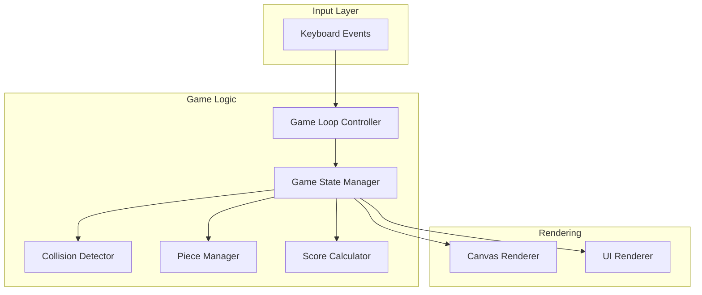

# Tetris Game Development - Product Requirements Document

## Executive Summary

### Problem Statement
Users need an engaging, classic gaming experience that provides entertainment and cognitive stimulation. The Tetris game format has proven to be one of the most popular and timeless puzzle games, offering simple mechanics with deep strategic gameplay that appeals to players of all ages and skill levels.

### Proposed Solution
Develop a fully functional Tetris game that implements the classic gameplay mechanics including falling tetrominoes, line clearing, scoring, and progressive difficulty. The game will provide an intuitive user interface with responsive controls and visual feedback.

### Expected Impact
- **User Entertainment**: Provide an engaging puzzle game experience that users can enjoy for quick sessions or extended play
- **Cognitive Benefits**: Offer spatial reasoning and quick decision-making challenges that improve cognitive skills
- **Accessibility**: Create a game that is easy to learn but difficult to master, appealing to both casual and hardcore gamers

### Success Metrics
- Game runs smoothly without performance issues (60 FPS minimum)
- All seven standard tetromino shapes function correctly
- Line clearing mechanics work accurately
- Score tracking and level progression function as expected
- Controls are responsive with no noticeable input lag

---

## Requirements & Scope

### Functional Requirements

| ID | Requirement | Priority |
|----|-------------|----------|
| REQ-1 | Display a 10x20 game board (standard Tetris dimensions) | Must |
| REQ-2 | Implement all seven standard tetromino shapes (I, O, T, S, Z, J, L) | Must |
| REQ-3 | Generate random tetrominoes that fall from the top of the board | Must |
| REQ-4 | Allow player to move tetrominoes left and right | Must |
| REQ-5 | Allow player to rotate tetrominoes clockwise | Must |
| REQ-6 | Allow player to accelerate tetromino descent (soft drop) | Must |
| REQ-7 | Allow player to instantly drop tetromino to bottom (hard drop) | Should |
| REQ-8 | Detect and clear completed horizontal lines | Must |
| REQ-9 | Award points for clearing lines (more points for multiple lines) | Must |
| REQ-10 | Track and display current score | Must |
| REQ-11 | Implement level progression that increases fall speed | Must |
| REQ-12 | Display next piece preview | Should |
| REQ-13 | Detect game over when pieces stack to the top | Must |
| REQ-14 | Allow player to start a new game | Must |
| REQ-15 | Allow player to pause and resume the game | Should |
| REQ-16 | Implement collision detection to prevent pieces from overlapping or going out of bounds | Must |
| REQ-17 | Display current level | Should |
| REQ-18 | Display lines cleared count | Should |

### Non-Functional Requirements

| ID | Requirement | Priority |
|----|-------------|----------|
| NFR-1 | Game must run at minimum 60 frames per second | Must |
| NFR-2 | Input response time must be under 50ms | Must |
| NFR-3 | Game must be playable using keyboard controls | Must |
| NFR-4 | Visual design must clearly distinguish different tetromino types | Must |
| NFR-5 | Game state must be rendered smoothly without visual glitches | Must |
| NFR-6 | Code must be maintainable and well-structured | Should |
| NFR-7 | Game should work across modern web browsers (if web-based) | Should |

### Out of Scope
- Multiplayer functionality
- Online leaderboards
- Sound effects and music (initial release)
- Mobile touch controls (initial release)
- Save/load game progress
- Ghost piece preview (showing where piece will land)
- Hold piece functionality
- Customizable themes or skins

### Success Criteria
- All seven tetromino shapes can be spawned, moved, rotated, and placed
- Lines are correctly detected and cleared when completed
- Score increases appropriately based on lines cleared
- Game speed increases as levels progress
- Game ends correctly when pieces reach the top
- No crashes or freezes during normal gameplay

---

## User Experience & Interface

### User Journey and Workflow

1. **Game Start**: User launches the game and sees the title screen or directly enters gameplay
2. **Active Play**: User controls falling tetrominoes using keyboard inputs
3. **Line Clearing**: Completed lines flash briefly and disappear, pieces above fall down
4. **Progression**: As score increases, level increases and pieces fall faster
5. **Game Over**: When pieces stack to the top, game over screen displays final score
6. **Restart**: User can choose to start a new game

### Interface Requirements

#### Game Board Area
- 10 columns × 20 rows visible playing field
- Clear grid lines or boundaries to help players position pieces
- Distinct colors for each tetromino type:
  - I-piece: Cyan
  - O-piece: Yellow
  - T-piece: Purple
  - S-piece: Green
  - Z-piece: Red
  - J-piece: Blue
  - L-piece: Orange

#### Information Panel
- Current score display (prominently visible)
- Current level indicator
- Lines cleared counter
- Next piece preview window

#### Controls Display
- Visual guide showing keyboard controls (can be optional or toggleable)

### User Interaction Patterns

| Action | Keyboard Input |
|--------|----------------|
| Move Left | Left Arrow or A |
| Move Right | Right Arrow or D |
| Rotate | Up Arrow or W |
| Soft Drop | Down Arrow or S |
| Hard Drop | Spacebar |
| Pause | P or Escape |
| New Game | Enter (on game over) |

### Accessibility Considerations
- High contrast colors for tetromino differentiation
- Clear visual feedback for line clearing
- Responsive controls that work with keyboard navigation

---

## Technical Considerations

### High-Level Technical Approach
The Tetris game will be implemented as a client-side application using a game loop architecture. The core game logic will be separated from the rendering layer to maintain clean code organization and allow for potential future enhancements.

### Key Technical Components

1. **Game State Management**
   - Board state represented as a 2D array
   - Current piece position, rotation, and type
   - Score, level, and lines cleared tracking
   - Game status (playing, paused, game over)

2. **Game Loop**
   - Fixed timestep for game logic updates
   - Variable timestep for rendering
   - Input polling and event handling

3. **Collision Detection System**
   - Boundary checking (left, right, bottom walls)
   - Piece-to-piece collision detection
   - Rotation collision validation with wall kicks

4. **Rendering System**
   - Board grid rendering
   - Active piece rendering
   - UI elements (score, level, next piece)
   - Animation for line clearing

### Integration Points
- Keyboard event listeners for user input
- Browser/platform rendering APIs (Canvas, DOM, or framework-specific)
- Timer/animation frame APIs for game loop

### Performance Considerations
- Efficient board state updates (only redraw changed cells)
- Minimal object allocation during gameplay to avoid garbage collection pauses
- Optimized collision detection algorithms

---

## Design Specification

### Recommended Approach
Implement the Tetris game using a web-based approach with HTML5 Canvas for rendering and vanilla JavaScript for game logic, providing cross-platform compatibility and easy deployment without requiring installations.

### Key Technical Decisions

#### 1. Technology Platform
- **Options Considered**: Web (HTML5/JavaScript), Desktop (Python/Pygame), Desktop (C++/SDL), Mobile Native
- **Tradeoffs**: Web offers instant accessibility but may have slight performance overhead; Desktop apps offer better performance but require installation; Mobile requires platform-specific development
- **Recommendation**: Web-based implementation using HTML5 Canvas - provides widest accessibility, no installation required, and sufficient performance for a Tetris game

#### 2. Rendering Approach
- **Options Considered**: HTML5 Canvas 2D, WebGL, DOM-based rendering, SVG
- **Tradeoffs**: Canvas 2D is simple and performant for 2D games; WebGL offers more power but is overkill; DOM rendering can cause performance issues; SVG adds complexity
- **Recommendation**: HTML5 Canvas 2D - optimal balance of simplicity, performance, and browser support for a tile-based game

#### 3. Game Loop Architecture
- **Options Considered**: setInterval, setTimeout, requestAnimationFrame, fixed timestep with interpolation
- **Tradeoffs**: requestAnimationFrame provides smooth rendering but variable timing; fixed timestep ensures consistent game logic but requires more code
- **Recommendation**: requestAnimationFrame with fixed timestep game logic - ensures consistent gameplay speed while maintaining smooth visuals

#### 4. State Management
- **Options Considered**: Object-oriented with classes, functional with immutable state, simple procedural
- **Tradeoffs**: OOP provides clear structure but may be verbose; functional is clean but less intuitive for game state; procedural is simple but can become messy
- **Recommendation**: Object-oriented approach with clear separation between game logic, rendering, and input handling

### High-Level Architecture



### Key Considerations

- **Performance**: Canvas 2D rendering with requestAnimationFrame provides smooth 60 FPS gameplay; only redraw changed board sections to minimize rendering overhead
- **Security**: Client-side only game with no server communication; score is local only (no leaderboard tampering concerns in initial release)
- **Scalability**: Modular architecture allows easy addition of features like sound, themes, or new game modes in future iterations

### Risk Management

- **Browser Compatibility Risk**: Different browsers may handle Canvas or keyboard events differently; mitigation through testing on major browsers (Chrome, Firefox, Safari, Edge)
- **Performance on Low-End Devices Risk**: Complex animations or inefficient rendering could cause lag; mitigation through performance profiling and optimization of rendering loop

### Success Criteria

- Game loads and runs in under 2 seconds on standard hardware
- Consistent 60 FPS during active gameplay
- No memory leaks during extended play sessions
- Controls feel responsive and accurate to player input

---

## User Stories

### Personas
- **Casual Player**: Someone looking for a quick, entertaining gaming session during breaks
- **Nostalgic Gamer**: Someone who grew up playing classic Tetris and wants to relive the experience
- **Skill Challenger**: Someone who wants to improve their high score and compete against themselves

### Core Stories

#### Story 1: Start New Game
**As a** player
**I want** to start a new game of Tetris
**So that** I can begin playing immediately

**Acceptance Criteria:**
- Given I am on the game screen
- When I press the start/new game button or the game auto-starts
- Then a new game begins with an empty board and score of 0

**Priority**: Must
**Related Requirements**: REQ-14

---

#### Story 2: Control Falling Pieces
**As a** player
**I want** to move and rotate the falling tetromino
**So that** I can position it where I want on the board

**Acceptance Criteria:**
- Given a tetromino is falling
- When I press the left arrow key
- Then the piece moves one cell to the left (if space available)

- Given a tetromino is falling
- When I press the right arrow key
- Then the piece moves one cell to the right (if space available)

- Given a tetromino is falling
- When I press the up arrow key
- Then the piece rotates 90 degrees clockwise (if rotation is valid)

**Priority**: Must
**Related Requirements**: REQ-4, REQ-5, REQ-16

---

#### Story 3: Speed Up Piece Descent
**As a** player
**I want** to make pieces fall faster
**So that** I can quickly place pieces and play more efficiently

**Acceptance Criteria:**
- Given a tetromino is falling
- When I hold the down arrow key
- Then the piece falls faster than normal speed (soft drop)

- Given a tetromino is falling
- When I press the spacebar
- Then the piece instantly moves to the lowest valid position (hard drop)

**Priority**: Must/Should
**Related Requirements**: REQ-6, REQ-7

---

#### Story 4: Clear Completed Lines
**As a** player
**I want** completed horizontal lines to be cleared
**So that** I can continue playing and earn points

**Acceptance Criteria:**
- Given a piece has been placed
- When one or more horizontal lines are completely filled
- Then those lines are cleared from the board
- And pieces above the cleared lines fall down
- And my score increases based on lines cleared

**Priority**: Must
**Related Requirements**: REQ-8, REQ-9, REQ-10

---

#### Story 5: See Game Progress
**As a** player
**I want** to see my score, level, and upcoming piece
**So that** I can track my progress and plan my moves

**Acceptance Criteria:**
- Given I am playing the game
- When I look at the game interface
- Then I can see my current score displayed
- And I can see my current level displayed
- And I can see the next piece that will fall

**Priority**: Should
**Related Requirements**: REQ-10, REQ-11, REQ-12, REQ-17, REQ-18

---

#### Story 6: Experience Progressive Difficulty
**As a** player
**I want** the game to get faster as I progress
**So that** the game remains challenging and engaging

**Acceptance Criteria:**
- Given I am playing the game
- When I clear enough lines to advance a level
- Then my level increases
- And pieces begin falling faster than before

**Priority**: Must
**Related Requirements**: REQ-11

---

#### Story 7: End Game and Restart
**As a** player
**I want** to know when the game is over and be able to restart
**So that** I can try to beat my previous score

**Acceptance Criteria:**
- Given pieces have stacked to the top of the board
- When a new piece cannot be placed
- Then the game ends
- And my final score is displayed
- And I can start a new game

**Priority**: Must
**Related Requirements**: REQ-13, REQ-14

---

## Dependencies & Assumptions

### Dependencies
- Modern web browser with HTML5 Canvas support
- JavaScript engine capable of running requestAnimationFrame
- Keyboard input capability

### Assumptions
- Users have access to a keyboard for input
- Users are familiar with basic Tetris gameplay concepts
- Target browsers include Chrome, Firefox, Safari, and Edge (latest versions)
- No server-side infrastructure is required for initial release

---

## Appendices

### Tetromino Shapes Reference

```
I-piece:  ████

O-piece:  ██
          ██

T-piece:  ███
           █

S-piece:   ██
          ██

Z-piece:  ██
           ██

J-piece:  █
          ███

L-piece:    █
          ███
```

### Scoring System (Standard Tetris)

| Lines Cleared | Points (× Level) |
|---------------|------------------|
| 1 (Single)    | 100              |
| 2 (Double)    | 300              |
| 3 (Triple)    | 500              |
| 4 (Tetris)    | 800              |

### Level Progression
- Lines required per level: 10 lines
- Speed increase per level: Approximately 10-15% faster fall rate
